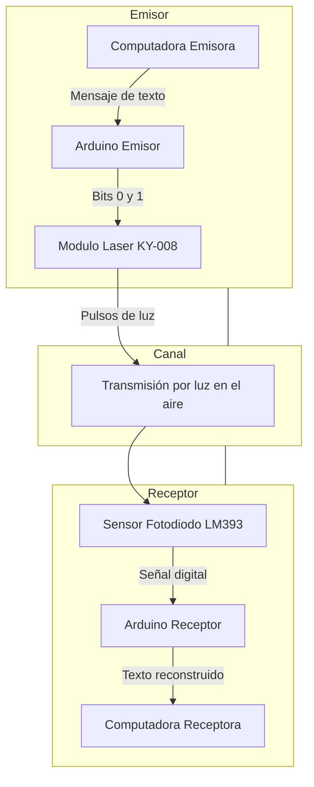

<h1 align="center">Sistema de Transmisión de Texto mediante Láser con Arduino</h1>

  
  
  

Este proyecto implementa un sistema básico de **comunicación óptica**,
donde un mensaje de texto se transmite utilizando **pulsos de luz
generados por un láser** y detectados por un **sensor de luz con
fotodiodo**.

El sistema convierte el texto en **datos binarios**, los transmite
mediante luz y luego reconstruye el mensaje en el receptor.

---

# Principio de funcionamiento

La comunicación se basa en representar los bits mediante luz:

- **1 → Láser encendido**
- **0 → Láser apagado**

Cada carácter del mensaje se convierte a **código ASCII**, que se
representa en **8 bits**.

La transmisión utiliza una estructura similar a la comunicación serial:

`START BIT | 8 BITS DE DATOS | STOP BIT`

---

# Arquitectura del sistema

---

# Materiales utilizados

- 2 × Arduino UNO R3
- 1 × Módulo láser **KY-008**
- 1 × Sensor de luz con **fotodiodo LM393**
- Cables Dupont macho-hembra
- 2 computadoras con **Arduino IDE**
- Caja negra para aislar el sensor de luz

---

# Conexiones

## Emisor (Módulo láser)

| Pin del Módulo Láser | Conexión en Arduino |
| -------------------- | ------------------- |
| S (Signal)           | Pin digital 8       |
| VCC                  | 5V                  |
| GND                  | GND                 |

## Receptor (Sensor de luz)

| Pin del Sensor      | Conexión en Arduino |
| ------------------- | ------------------- |
| DO (Digital Output) | Pin digital 7       |
| VCC                 | 5V                  |
| GND                 | GND                 |

---

# Funcionamiento del sistema

## Emisor

1.  El usuario escribe un mensaje en la computadora.
2.  El Arduino recibe el texto mediante **comunicación serial**.
3.  Cada carácter se convierte a **ASCII**.
4.  El valor ASCII se convierte a **binario (8 bits)**.
5.  Los bits se transmiten encendiendo o apagando el láser.

Formato de transmisión:

`START BIT → 8 BITS → STOP BIT`

Cada bit tiene una duración aproximada de **25 ms**.

## Receptor

1.  El sensor fotodiodo detecta los cambios de luz del láser.
2.  El Arduino receptor identifica el **bit de inicio**.
3.  Espera **1.5 veces la duración del bit** para leer en el centro del
    primer bit de datos.
4.  Lee los **8 bits del carácter**.
5.  Reconstruye el valor ASCII.
6.  Convierte el valor a texto y lo muestra en la computadora.

---

# Ejemplo de transmisión

Carácter enviado: `A`\
ASCII: `65`\
Binario: `01000001`\
Transmisión: `START → 01000001 → STOP`
